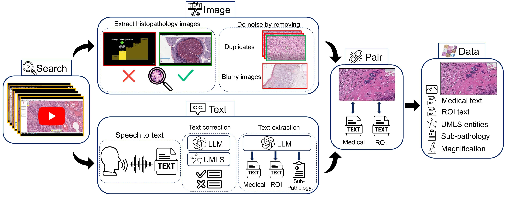
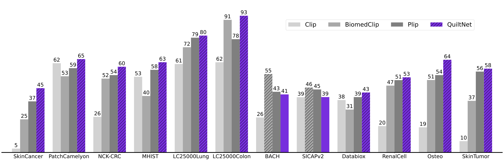
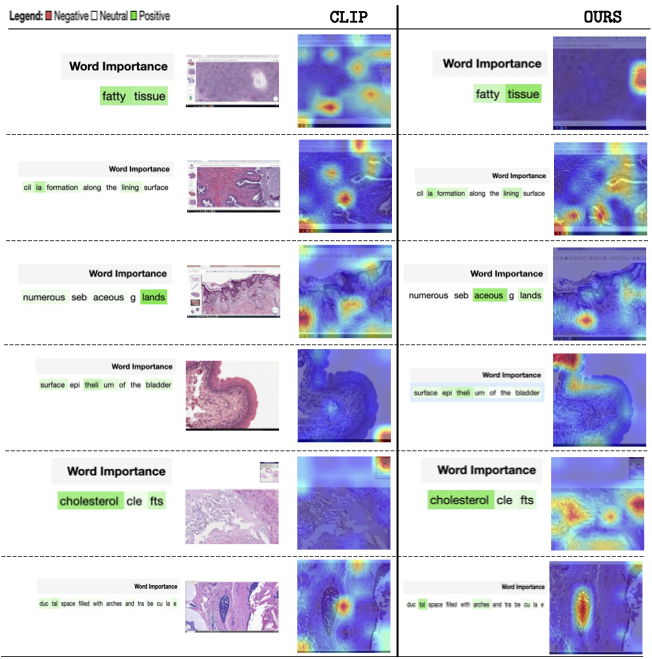

# Quilt
[Quilt-1M: One Million Image-Text Pairs for Histopathology](https://quilt1m.github.io/)



### [Paper](https://arxiv.org/pdf/2306.11207.pdf) | [Huggingface Demo](https://huggingface.co/wisdomik/QuiltNet-B-32) 


## Abstract
>Recent accelerations in multi-modal applications have been made possible with the plethora of image and text data available online. However, the scarcity of similar data in the medical field, specifically in histopathology, has slowed similar progress. To enable similar representation learning for histopathology, we turn to YouTube, an untapped resource of videos, offering 1,087 hours of valuable educational histopathology videos from expert clinicians. From YouTube, we curate Quilt: a large-scale vision-language dataset consisting of 802,148 image and text pairs. Quilt was automatically curated using a mixture of models, including large language models, handcrafted algorithms, human knowledge databases, and automatic speech recognition. In comparison, the most comprehensive datasets curated for histopathology amass only around 200K samples. We combine Quilt with datasets, from other sources, including Twitter, research papers, and the internet in general, to create an even larger dataset: Quilt-1M, with 1M paired image-text samples, marking it as the largest vision-language histopathology dataset to date. We demonstrate the value of Quilt-1M by fine-tuning a pre-trained CLIP model. Our model outperforms state-of-the-art models on both zero-shot and linear probing tasks for classifying new pathology images across 13 diverse patch-level datasets of 8 different sub-pathologies and cross-modal retrieval tasks.
>
## News
- [x] *2023-03-03* Upated repository with links to models and data.
- [x] *2023-06-13* Inital ccode/data release.
- [x] *2023-06-25* Added model evaluate tips and added some new data links.
- [x] *2023-08-15* Added restricted access to complete dataset.


## Data (QUILT-1M) Restricted Access
Two versions of the data can be accessed after agreeing to certain terms, protecting against further distribution of the dataset and committing to its specified research use.


- (Rescaled) On [Zenodo](https://zenodo.org/record/8239942) you can access the dataset with all images resized to 512x512 px (36 Gb)
- (Full) To access the dataset with full-sized images via Google Drive, please request time-limited access through this form [Google](https://forms.gle/TKohQ7zLwYfFn8qRA) (110 Gb)


## Requirements
```bash
conda create --name quilt python=3.9 && conda activate quilt
```
Then install [requirements/](data/requirements.txt)


## Data Reconstruction
To collect Quilt, follow these [data steps/](data/README.md)


## Eval
To evaluate QuiltNet, follow these [steps/](eval/README.md)


## Pretrained Model
We provide the checkpoints for all QuiltNet finetuned models.

- [ViT-B-32|GPT77](https://huggingface.co/wisdomik/QuiltNet-B-32).
- [ViT-B-16|GPT77](https://huggingface.co/wisdomik/QuiltNet-B-16).
- [ViT-B-16|PMB-256](https://huggingface.co/wisdomik/QuiltNet-B-16-PMB).


## Testing
Visualization of inputs and output:






## Citing Quilt-1M

```
@misc{ikezogwo2023quilt1m,
      title={Quilt-1M: One Million Image-Text Pairs for Histopathology}, 
      author={Wisdom Oluchi Ikezogwo and Mehmet Saygin Seyfioglu and Fatemeh Ghezloo and Dylan Stefan Chan Geva and Fatwir Sheikh Mohammed and Pavan Kumar Anand and Ranjay Krishna and Linda Shapiro},
      year={2023},
      eprint={2306.11207},
      archivePrefix={arXiv},
      primaryClass={cs.CV}
}

```

## Acknowledgements

This code borrows heavily from and [open-clip](https://github.com/mlfoundations/open_clip) and [TiMM's library](https://github.com/huggingface/pytorch-image-models). We also thank the contributors of [merlot](https://github.com/rowanz/merlot).

## Maintenance

Please open a GitHub issue for any help. If you have any questions regarding the technical details, feel free to contact us.

## License
The codes and the pretrained model in this repository are under the MIT license as specified by the LICENSE file.
